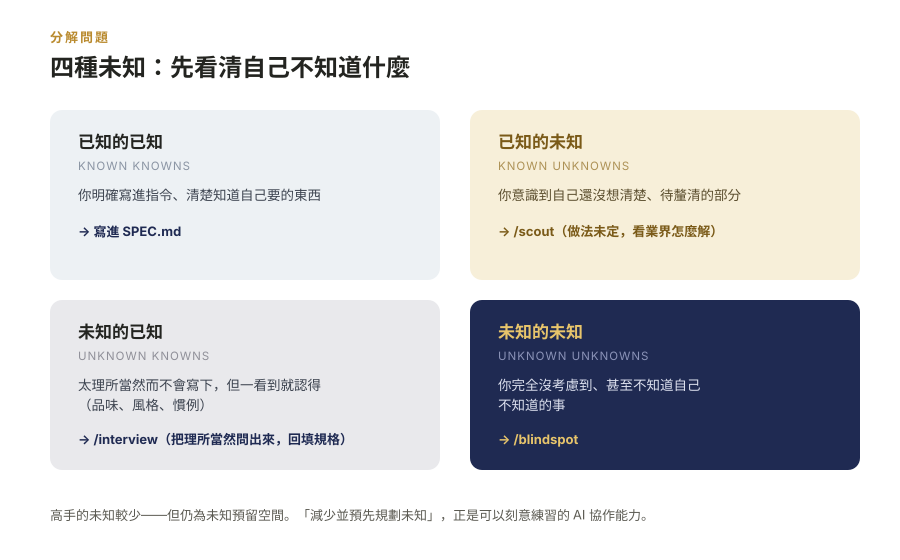
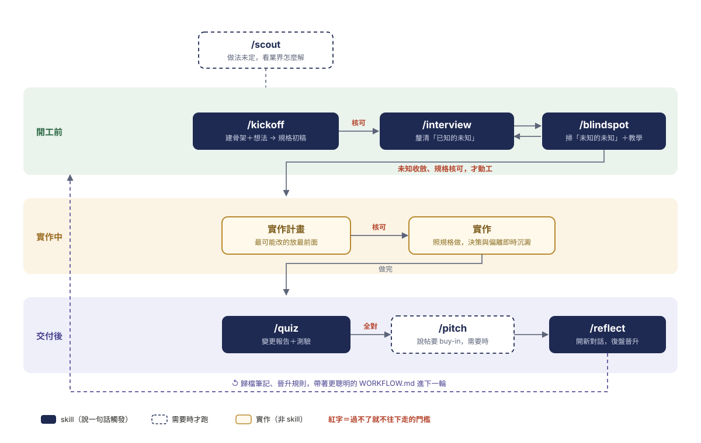
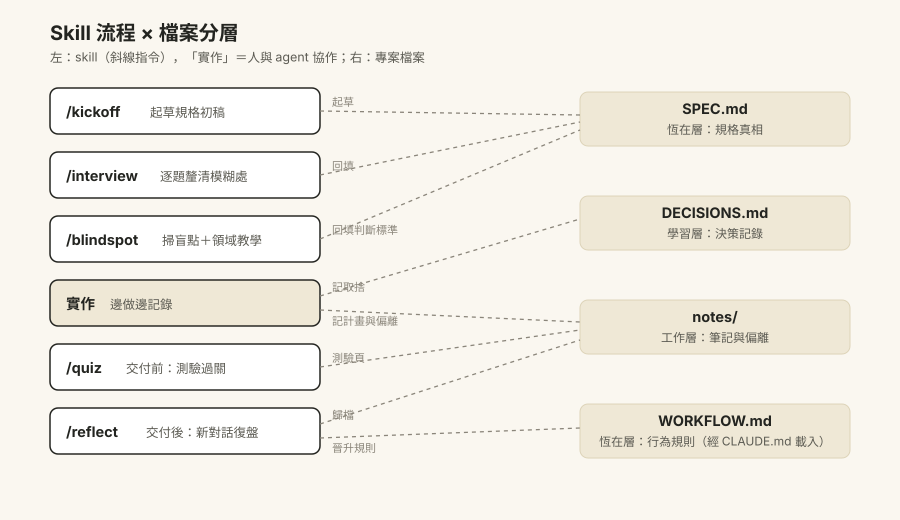

# Finding-Unknowns Workflow Skills

**English version: [en/README.md →](en/README.md)**（本頁為繁體中文完整版）

一套讓 Claude Code「先找出未知、再動工」的工作流 skills：從粗略想法起草規格、訪談問出理所當然的預設、掃描盲點、交付前測驗、復盤晉升——決策與教訓都落在專案檔案裡，跨對話存活。核心想法來自 Thariq Shihipar 的〈[A Field Guide to Claude Fable 5: Finding Your Unknowns](https://claude.com/blog/a-field-guide-to-claude-fable-finding-your-unknowns)〉：工作品質的瓶頸，是你有沒有能力在動工前把「未知」攤開。

## 安裝（二選一）

```bash
# 方式一：直接複製（指令名最乾淨：/kickoff、/interview⋯）
cp -R zh-TW/skills/* ~/.claude/skills/     # 繁體中文版
cp -R en/skills/* ~/.claude/skills/        # English（擇一安裝，兩套 skill 同名）
```

```
# 方式二：Claude Code plugin（跟著 repo 更新，指令會帶前綴）
/plugin marketplace add mirandaplayer1/finding-unknowns-workflow-zh
/plugin install finding-unknowns-zh-tw@finding-unknowns-workflow-zh
```

裝完在任何空資料夾開 `claude`，說「我想做○○○」就會啟動。實際可貼的 prompt 見 [EXAMPLES.md](zh-TW/EXAMPLES.md)；不想裝 skill 的人可以用[單檔精簡版](zh-TW/guidance/finding-unknowns.md)（貼進 CLAUDE.md 即可）。

## 未知的四個象限

| | 你知道 | 你不知道 |
|---|---|---|
| **它存在** | 已知的已知：寫進規格 | 已知的未知：`/scout` 看業界怎麼解 |
| **它不存在** | 未知的已知：`/interview` 把理所當然問出來 | 未知的未知：`/blindspot` 掃描 |



## 七個 skill

| 階段 | Skill | 做什麼 |
|---|---|---|
| 開工前 | `/kickoff` | 建骨架（缺件時）＋從粗略想法起草 SPEC.md |
| 開工前 | `/scout` | 做法未定時，調查業界怎麼解（產出比較報告） |
| 開工前 | `/interview` | 逐題問出「未知的已知」（理所當然的預設），答案回填規格 |
| 開工前 | `/blindspot` | 掃「未知的未知」＋領域速成教學 |
| 交付前 | `/quiz` | 變更報告＋理解測驗，全對才交付 |
| 交付時 | `/pitch` | 懶人包／explainer，給別人看、要 buy-in |
| 交付後 | `/reflect` | **開新對話**復盤，把教訓晉升成規則 |

一輪工作長這樣（實線框＝說一句話就會觸發的 skill；虛線＝需要時才跑；紅字＝過不了就不往下走的門檻）：



## 檔案分層（專案記憶）

`/kickoff` 會在專案建立這些檔案：

- `SPEC.md`——規格，唯一真相來源
- `DECISIONS.md`——決策記錄（教學導向：記選項、取捨、下次怎麼自己判斷）
- `notes/implementation-notes.md`——本輪計畫與偏離記錄，`/reflect` 後歸檔
- `WORKFLOW.md`——工作規則，經 `CLAUDE.md` 的 `@WORKFLOW.md` 自動載入



> 註：repo 裡 `skills/kickoff/assets/.claude/skills/` 的種子 skill 檔以 `SKILL.md.template` 存放，`/kickoff` 建骨架時會自動改回 `SKILL.md`——避免 plugin 打包驗證器把模板誤判成撞名的 skill。

## 症狀 → 該跑哪個

- 只有一個模糊想法 → `/kickoff`
- 有幾種做法選不出來 → `/scout`
- 知道哪裡沒想清楚 → `/interview`
- 進了不熟的領域、怕漏掉什麼 → `/blindspot`
- 做完了，不確定自己真的懂 → `/quiz`

## Credit 與授權

- 工作流方法來自 Thariq Shihipar（Anthropic）的公開文章〈[A Field Guide to Claude Fable 5: Finding Your Unknowns](https://claude.com/blog/a-field-guide-to-claude-fable-finding-your-unknowns)〉；本 repo 的指令文字為原創整理。
- 打包方式（README 結構、單檔精簡版）與部分機制設計參考了英文社群整理版 [Neeeophytee/finding-unknowns-skills](https://github.com/Neeeophytee/finding-unknowns-skills)。
- 文字採 MIT 授權，詳見 [LICENSE](LICENSE)。

與英文社群版最大的差異：本套件不只是技巧包，還附**專案檔案分層**（SPEC.md／DECISIONS.md／notes/／WORKFLOW.md）——決策與教訓落在檔案裡跨對話存活，並由 `/reflect` 定期蒸餾成規則。
