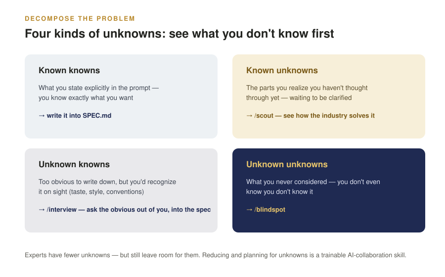
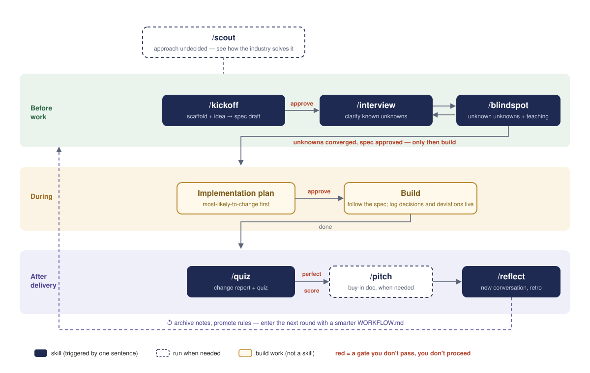
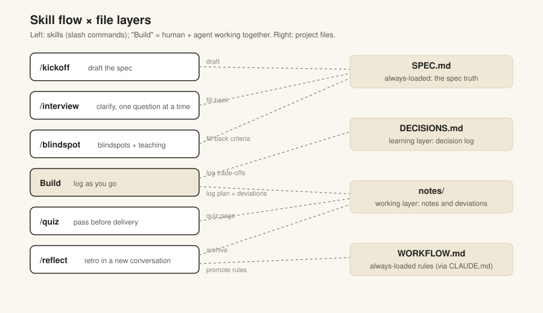

# Finding-Unknowns Skills (English Edition)

Install (pick one):

```bash
# Option 1: copy directly (cleanest command names: /kickoff, /interview, ...)
cp -R skills/* ~/.claude/skills/
```

```
# Option 2: Claude Code plugin (tracks repo updates; commands get a prefix)
/plugin marketplace add mirandaplayer1/finding-unknowns-workflow-zh
/plugin install finding-unknowns-en@finding-unknowns-workflow-zh
```

Once installed, open `claude` in any empty folder and say "I want to build X" to kick things off. For real prompts you can paste, see [EXAMPLES.md](EXAMPLES.md); if you'd rather not install skills, use the [single-file lite version](guidance/finding-unknowns.md) (just paste it into CLAUDE.md).

A set of workflow skills that make Claude Code "find the unknowns first, then start work." The core idea comes from Thariq Shihipar's "[A Field Guide to Claude Fable 5: Finding Your Unknowns](https://claude.com/blog/a-field-guide-to-claude-fable-finding-your-unknowns)": the bottleneck on work quality is whether you can lay out the "unknowns" before starting.

## The four quadrants of unknowns

| | You know it | You don't know it |
|---|---|---|
| **It exists** | Known knowns: write into the spec | Known unknowns: `/scout` how the industry solves it |
| **It doesn't exist** | Unknown knowns: `/interview` asks the obvious out of you | Unknown unknowns: scan with `/blindspot` |



## The seven skills

| Phase | Skill | What it does |
|---|---|---|
| Before work | `/kickoff` | Build the scaffold (if missing) + draft SPEC.md from a rough idea |
| Before work | `/scout` | When the approach is undecided, research how the industry solves it (produces a comparison report) |
| Before work | `/interview` | Ask out "unknown knowns" (taken-for-granted assumptions) one question at a time; answers flow back into the spec |
| Before work | `/blindspot` | Scan for "unknown unknowns" + domain crash course |
| Before delivery | `/quiz` | Change report + comprehension quiz — deliver only on a perfect score |
| At delivery | `/pitch` | Pitch (explainer) for showing others and getting buy-in |
| After delivery | `/reflect` | Retrospective **in a new conversation**; promote lessons into rules |

One round of work looks like this (solid boxes = skills triggered by one sentence; dashed = run when needed; red = gates):



## File layers (project memory)

`/kickoff` creates these files in the project:

- `SPEC.md` — the spec, single source of truth
- `DECISIONS.md` — decision log (teaching-oriented: options, trade-offs, how to judge it yourself next time)
- `notes/implementation-notes.md` — this round's plan and deviation log, archived after `/reflect`
- `WORKFLOW.md` — working rules, auto-loaded via `@WORKFLOW.md` in `CLAUDE.md`




## Symptom → which one to run

- All you have is a vague idea → `/kickoff`
- Several approaches and you can't pick → `/scout`
- You know where you haven't thought it through → `/interview`
- You've entered an unfamiliar domain and fear missing something → `/blindspot`
- It's done, but you're not sure you truly understand it → `/quiz`

## Credit and license

- The workflow method comes from the public article by Thariq Shihipar (Anthropic), "[A Field Guide to Claude Fable 5: Finding Your Unknowns](https://claude.com/blog/a-field-guide-to-claude-fable-finding-your-unknowns)"; the instruction text in this repo is an original synthesis.
- The packaging (README structure, single-file lite version) and parts of the mechanism design draw on the English community compilation [Neeeophytee/finding-unknowns-skills](https://github.com/Neeeophytee/finding-unknowns-skills).
- Text is MIT licensed — see [LICENSE](../LICENSE).

The biggest difference from the English community version: this package isn't just a bag of techniques — it ships **project file layers** (SPEC.md / DECISIONS.md / notes/ / WORKFLOW.md), so decisions and lessons land in files that survive across conversations, periodically distilled into rules by `/reflect`.
